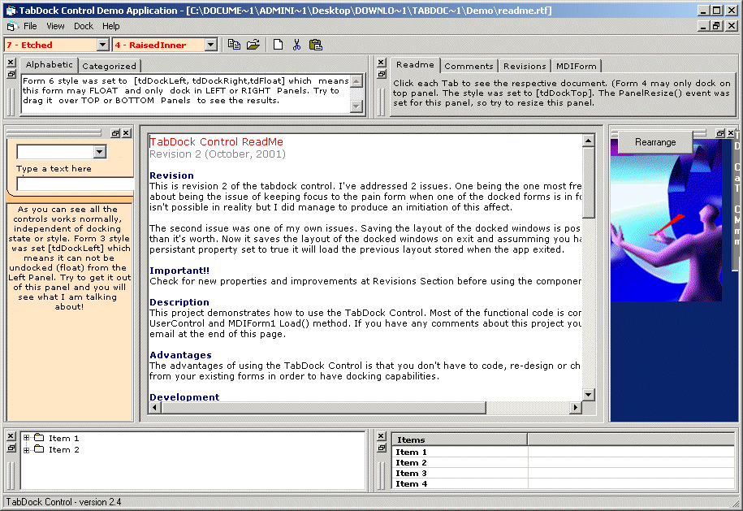



## TabDock Version 2\.4

### Description

Update:

Thanks to neal who added the support for the maximize like button which makes the docked window maximize along with titlebar appearing on the side on top/bottom windows.

TabDock is designed to provide Docking support similiar to that seen in Visual Basic itself, VC++, and a number of other programs available on the market today. It was originally written by Marclei V Silva and though an excellent control it was somewhat on the buggy side and was missing a number of features.

This version has many of the desired features and all the known bugs have been worked out of it. It also directly incorperates the ssubtmr.dll from vbaccelerator so it is no longer a seperate requirement. New titlebar drawing methods are offered as well to give you options on how titlebars are drawn, and bottom/top docking is done side by side instead of on top of eachother. Also a persistant option is included which allows the tabdock control to automaticly load it's saved state up for you. It saves it even if the persistant state is off but will only read it and use it if the persistant state is on. It uses the registry.

Comments are welcome, and appreciated. You may modify and repost this code. The original author gave myself and Neal permission and the same permission is extended from us to you. This code is fairly advanced, and uses a lot of subclassing to achieve it's effect. Please note it is not recomended you close the IDE while running this through the IDE, it will likely crash if you do. Anyway enjoy :)
 
### More Info
 

             |
---                |---
**Submitted On**   |2003-04-04 15:41:50
**By**             |[Stewart](https://github.com/Planet-Source-Code/PSCIndex/blob/master/ByAuthor/stewart.md)
**Level**          |Advanced
**User Rating**    |4.8 (217 globes from 45 users)
**Compatibility**  |VB 5\.0, VB 6\.0
**Category**       |[Custom Controls/ Forms/  Menus](https://github.com/Planet-Source-Code/PSCIndex/blob/master/ByCategory/custom-controls-forms-menus__1-4.md)
**World**          |[Visual Basic](https://github.com/Planet-Source-Code/PSCIndex/blob/master/ByWorld/visual-basic.md)
**Archive File**   |[TabDock\_Ve156942452003\.zip](https://github.com/Planet-Source-Code/stewart-tabdock-version-2-4__1-44409/archive/master.zip)

